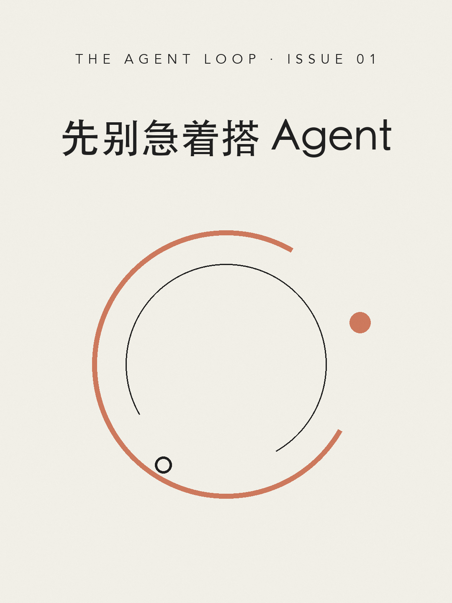
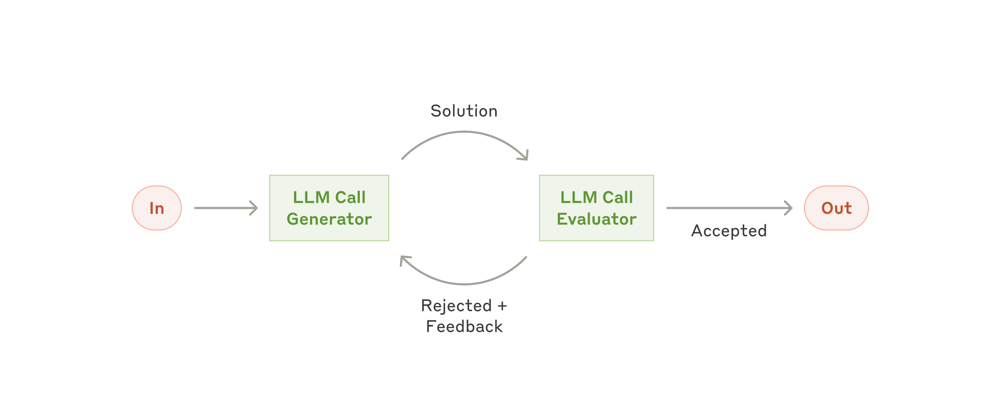

*原文:Anthropic Engineering / Erik Schluntz, Barry Zhang · 2024-12-19 · 备份在 `resources/2024-12-anthropic-building-effective-agents.md`*

*备注:Anthropic 持续维护线上版本(Claude Agent SDK、Claude Haiku/Sonnet 4.5 等是后续更新的内容);备份是 2026-05-22 抓取版。下文 8 张图全部直接取自 Anthropic 原文。*

## 概览

- **核心立场**:最成功的 LLM agent 实现 = 简单 + 可组合的模式,而非复杂框架。**找最简单方案,只在必要时增加复杂度——这可能意味着根本不需要 agentic system**。
- **关键区分**:agentic system 内部分两类——**workflow**(LLM 沿写死代码路径)与 **agent**(LLM 自主决定流程)。差别在「控制流归谁」。
- **三层技术栈**:augmented LLM → 5 种 workflow 模式 → 自主 agent;按需选层。
- **三条工程原则**:simplicity / transparency / **ACI**(给工具写定义,要花的功夫和写 prompt 一样多)。
- **两个落地领域**:客服 agent、编码 agent。共同特征:对话 + 行动、清晰成功标准、反馈循环、人类监督。

## 一、关键概念

### Agentic system 的两类

| | Workflow | Agent |
|---|---|---|
| **定义** | LLM 和工具沿**预定义代码路径**编排 | LLM **自主决定**流程和工具使用 |
| **控制流** | 在代码里 | 在模型里 |
| **何时用** | 任务清晰、要可预测一致 | 要灵活、模型驱动、规模化 |
| **典型风险** | 不够灵活 | 错误累积、成本高 |

两者都属 **agentic system** 的子类。

### Augmented LLM

*图:Anthropic — LLM 周围接 Retrieval(Query / Results)、Tools(Call / Response)、Memory(Read / Write);In → LLM → Out 主线之外,三条增强通道按需调用。*

- 公式:**augmented LLM = LLM + retrieval + tools + memory**
- 当代模型能主动用这些能力——自己生成查询、选工具、决定保留信息
- 实现重点:**为用例量身定制** + **易用文档化接口**
- 一种实现路径:**MCP(Model Context Protocol)**——通过简单 client 接入第三方工具生态

> 之后讲的 5 种 workflow 和 agent,都默认 LLM 已具备 augmentation。

## 二、决策与取舍

### 何时不该启动 agentic system

- 默认动作:找**最简单方案**——这可能意味着根本不需要 agentic system
- agentic system 本质是用**延迟 + 成本**换**任务表现**;先确认这笔交易划算
- 多数应用其实:**单次 LLM 调用 + 检索 + in-context 示例**就够

### 复杂度选型

| 复杂度 | 选什么 | 适合什么 |
|---|---|---|
| 低 | 单次 LLM + 检索 + 示例 | 大多数应用 |
| 中 | **workflow** | 任务可拆,需要可预测一致 |
| 高 | **agent** | 步数不可测、要模型自主、可信环境规模化 |

### 框架要不要用

常见 agent 框架:**Claude Agent SDK**、**Strands Agents SDK**(AWS)、**Rivet**(拖拽 GUI)、**Vellum**(GUI)。

- **优点**:简化"调 LLM / 定义解析工具 / 串调用"等底层任务,容易起步
- **缺点**:
  - 抽象层**遮蔽底层 prompt 和响应**,使调试难
  - 容易**诱导过度复杂**——明明更简单就够
- **建议**:**先直接用 LLM API**(很多模式只要几行代码);用框架就必须搞清楚底层在干什么——对底层错误假设是客户最常见的错误源
- **参考**:Anthropic cookbook(`platform.claude.com/cookbook/patterns-agents-basic-workflows`)有示例实现

## 三、五种 workflow 模式

| 模式 | 定义 | 何时用 | 典型例子 |
|---|---|---|---|
| **Prompt chaining** | 拆成一串顺序步骤,中间可加 "gate" 程序化校验 | 任务能干净拆成固定子步骤;以延迟换准确率 | ① 生成营销文案 → 翻译;② 写大纲 → 检查大纲 → 据大纲写正文 |
| **Routing** | 输入分类后路由到专门下游 | 类别清晰、分类能做准;关注点分离 | ① 客服查询按一般/退款/技术支持分流;② 简单问题 → Haiku 4.5,难题 → Sonnet 4.5 |
| **Parallelization** | sectioning(独立子任务并行)+ voting(同任务多次跑) | 子任务能并行可提速;或需多视角/多次提置信度 | sectioning:guardrail 分流主查询;voting:代码安全多审 |
| **Orchestrator-Workers** | 中央 LLM **动态拆任务**派 worker,综合结果 | 子任务**无法预先定义**;典型:编码、多源搜索 | ① 编码产品改多文件;② 多源信息收集分析 |
| **Evaluator-Optimizer** | 一个 LLM 生成、另一个评估反馈,**循环迭代** | 有清晰评判标准;迭代能带来可衡量提升;LLM 能给出反馈 | ① 文学翻译细节;② 多轮复杂搜索 |

### 各模式图示

**Prompt Chaining**

*图:Anthropic — In → LLM Call 1 → Gate(Pass / Fail) → LLM Call 2 → LLM Call 3 → Out。Gate 校验失败则提前 Exit。*

**Routing**

*图:Anthropic — In → LLM Call Router 分类 → 选一条下游(LLM Call 1 / 2 / 3)→ Out。下游分支并行存在,但每次只走其中一条。*

**Parallelization**

*图:Anthropic — In 同时分发给 LLM Calls 1 / 2 / 3 并行执行 → Aggregator 聚合 → Out。Sectioning(独立子任务并行)和 Voting(同任务多次跑)拓扑一致,差别在每条分支跑的是不同任务还是同一任务。*

**Orchestrator-Workers**

*图:Anthropic — In → Orchestrator 临场拆任务 → 派给 LLM Calls 1 / 2 / 3 → Synthesizer 综合 → Out。与 Parallelization 拓扑相似,关键差别是 worker 的任务由 orchestrator **临场决定**,不是预先切好。*

**Evaluator-Optimizer**

*图:Anthropic — In → LLM Call Generator → Solution → LLM Call Evaluator;Accepted 走出去成为 Out,Rejected + Feedback 回到 Generator 再生成,直到通过。*

### Parallelization 的两种变种(摊开)

- **Sectioning**(独立子任务并行)
  - guardrail —— 一个 LLM 处理查询,另一个并行筛查不当内容(比单个 LLM 同时干两件事好)
  - 自动化 eval —— 不同 LLM 调用评估不同维度
- **Voting**(同任务多次跑)
  - 代码安全审查 —— 多个 prompt 分别审查,任一报问题即标记
  - 内容不当判断 —— 多 prompt 评不同维度,或设投票阈值平衡假阳/假阴

### Orchestrator-Workers 与 Parallelization 的关键差别

拓扑相似,**子任务是否预先定义**就是分水岭:

- Parallelization:子任务**预先切好**
- Orchestrator-Workers:子任务由 orchestrator **临场决定**

子任务一旦由 LLM 临场决定,**控制权已经交一部分给模型**——这是 workflow 滑向 agent 的位置。

### Evaluator-Optimizer 的两个适用信号

两个都满足才好用:

1. 当人类清晰表达反馈时,LLM 响应能明显改进
2. LLM 自己能给出这种反馈

类比:人类反复打磨文稿的过程。

## 四、Agent 自身

*图:Anthropic — LLM Call 一边与 Human 互通(用于澄清/确认),一边与 Environment 跑「Action → Feedback」循环;满足条件时 Stop。整篇 agent 一节讲的就是这张图怎么落地。*

### 运行流程(5 步)

1. 从用户**命令或互动讨论**开始
2. 任务清楚后,**自主规划和执行**;必要时回找人确认信息或判断
3. 执行中**每一步从环境拿 "ground truth"**(工具调用结果、代码执行结果)评估进展
4. 在 **checkpoint** 或卡住时**暂停等人反馈**
5. 任务完成时终止;常加 **stopping condition**(如最大迭代数)兜底

### 本质

**agent = LLM 在循环里基于环境反馈使用工具**。实现往往很直接;真正复杂的是**工具集和工具文档的设计**(详见六、工具与 ACI)。

### 适用 / 代价 / 必备

| | |
|---|---|
| **适用** | 开放式问题、步数无法预测、不能写死路径、对模型有基本信任、可信环境规模化任务 |
| **代价** | 成本更高;**错误会累积** |
| **必备** | **沙箱环境充分测试** + **guardrail** |

### Anthropic 自家例子

- 解 SWE-bench 任务的**编码 agent**(基于任务描述改多个文件)
- **"computer use"** 参考实现——Claude 用电脑完成任务

## 五、三条工程原则

| 原则 | 含义 | 落地 |
|---|---|---|
| **Simplicity** | agent 设计上保持简单 | 不堆抽象、不加无必要的中间层 |
| **Transparency** | 明确展示 agent 的**规划步骤** | 让 agent 的思考可见,便于调试和信任 |
| **ACI**(Agent-Computer Interface) | 工具接口要和 prompt 同等用心 | 见六、工具与 ACI |

附:框架能帮快速起步,但**生产化时不要犹豫减少抽象层、回归基本组件**。Anthropic 自家做 SWE-bench agent 时,**在工具优化上花的时间比在整体 prompt 上还多**。

## 六、工具与 ACI

### 工具格式选择(对 LLM 不是无损转换)

同一动作往往有多种表达,工程师看是表面差异(可无损转换),但**对 LLM 难度差别巨大**:

- 写 **diff** 比整文件**重写**难——要在写代码前知道改动行数(chunk header)
- **JSON 里的代码**比 **markdown 里的代码**难——多转义换行和引号

### 工具格式的三条原则

1. **给模型留够 token 让它"思考"**——别让它写到没退路
2. **格式贴近模型在互联网自然文本里见惯的样子**
3. **避免格式 "overhead"**——别让它精确数千行计数、或转义自己写的每段代码

### ACI 设计 4 步(像设计 HCI 一样)

1. **站在模型视角看工具** —— 使用方式是否一目了然?好的工具定义应包含:示例用法、边界情况、输入格式要求、与其他工具的边界
2. **参数名和描述写得显然** —— 当成给团队 junior 工程师的 docstring;**有很多相似工具时尤其重要**
3. **测试 + 迭代** —— 在 workbench 里跑大量示例,看模型出什么错,据此改
4. **Poka-yoke(防呆)** —— 修改参数让出错更难

### 具体案例:绝对路径

为 SWE-bench 构建 agent 时,Anthropic 在工具优化上花的时间**比在整体 prompt 上还多**。

- **问题**:模型在用相对路径的工具时,agent 移出根目录后会犯错
- **修复**:**改工具为强制要求绝对路径**
- **结果**:模型用这个方法**毫无差错**

## 七、落地领域

### 共同特征(agent 在这里特别有价值)

- 需要**对话 + 行动**
- 有**清晰成功标准**
- 有**反馈循环**
- 有**有意义的人类监督**

### 客服 agent 与编码 agent 对比

| | Customer Support | Coding Agents |
|---|---|---|
| **为什么适合** | 客服天然是会话流;需要外部信息 + 动作 | 代码方案可由**自动测试验证** |
| **工具集成** | 客户数据、订单历史、知识库 | 编辑、测试、版本控制 |
| **反馈来源** | 用户确认"解决" | 自动测试结果 |
| **输出衡量** | 用户定义的"解决"(清晰) | 客观可测 |
| **已验证形式** | 按**成功解决数收费**的商业模式(本身就显示对效果的信心) | **SWE-bench Verified**:agent 仅凭 PR 描述就能解真实 GitHub issue |
| **注意** | —— | **人工 review 仍关键**,确保方案与系统需求对齐 |

### 编码 agent 的完整流程示例

下图把第四节抽象的 agent 循环具体化:一个 coding agent 端到端是怎样运转的。

*图:Anthropic — Human 把 Query 交给 Interface;Interface ↔ LLM 在「Until tasks clear」(Clarify / Refine 循环)里把任务说清楚 → LLM 接管,拿到上下文后向 Environment 做 Search files / Return paths,然后进入「Until tests pass」(Write code / Status / Test / Results 循环) → 完成后 Complete → Display 给用户。*

## 八、组合与定制

- 这些 building block **不是规定式**,是可塑可组合的模式
- 成功靠**测量性能 + 迭代**
- **复杂度只在有据可证能改善结果时才加**(原文反复强调)
